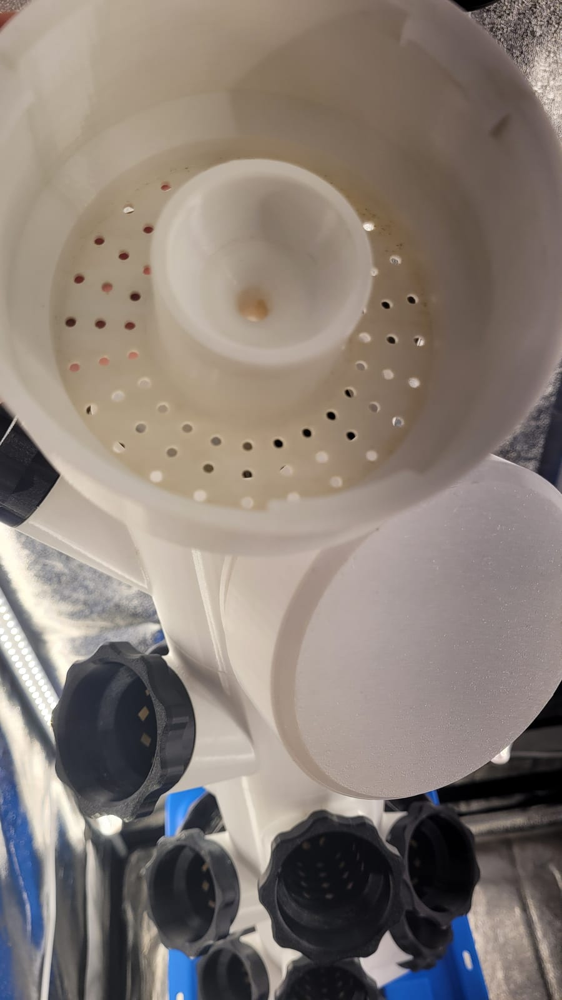
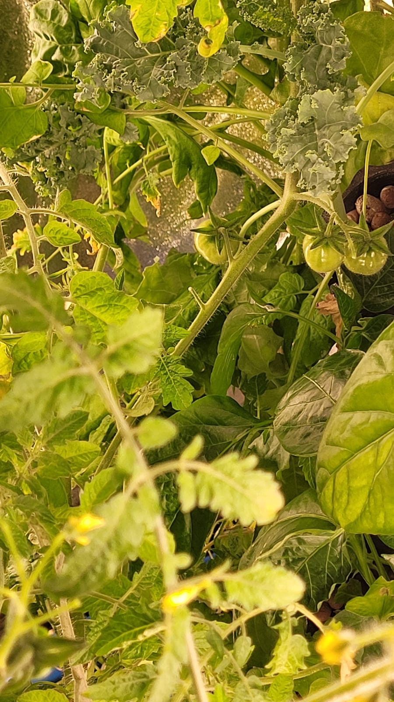

Once the [tower](/builds/hydro-tower) proved a printed column could grow food, it needed somewhere to put the plants. Each one sits in its own printed pod: a mesh basket that holds the growing medium and lets roots reach into the column, on a threaded collar that seats it into the tower at an angle so the plant leans out toward the light.

## The basket

Open enough for roots and water to pass freely, stiff enough to hold a maturing plant and its medium without sagging. The mesh pattern carries most of that. Too closed and the roots can't breathe, too open and the medium washes out:

## What grows in them

All the printing is for what comes out of it. The pods carry far more than salad: peppers, herbs, and full trusses of tomatoes, fruiting indoors and out of season:

A planted tower fills in fast, the canopy spilling out of the pods until you can barely see the column underneath:

## Print and repeat

Pods are small, so they print fast and I keep a stack of spares. A tower needs a couple dozen, and a cracked one is a one-pod problem instead of a whole-tower one. They're cheap and quick to reprint, which is what makes a printed [column](/builds/hydro-tower) usable as a garden.
