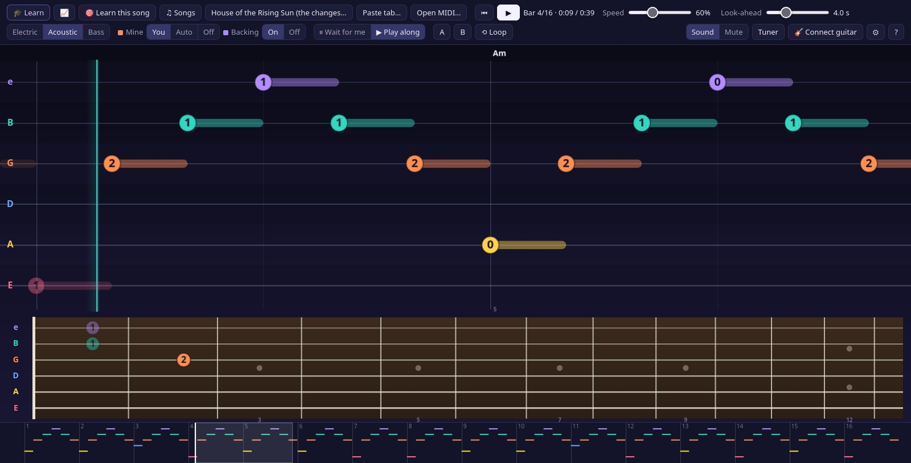
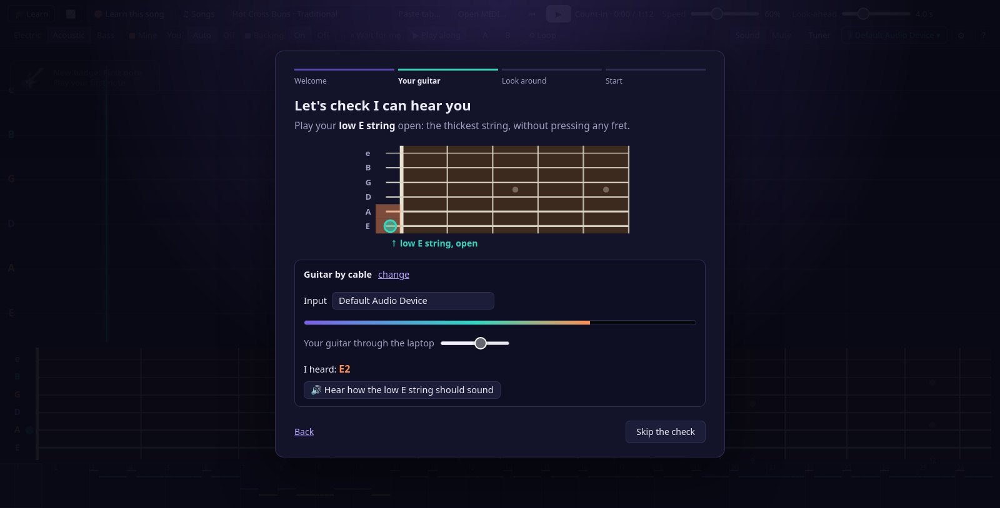
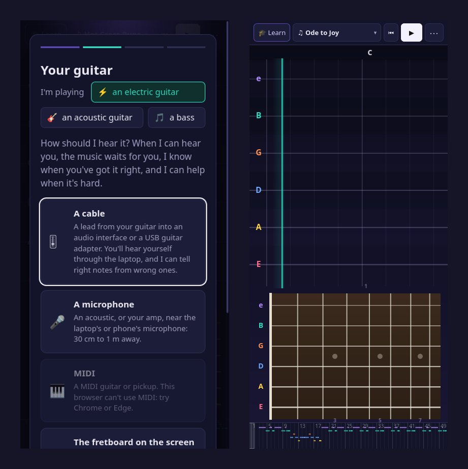
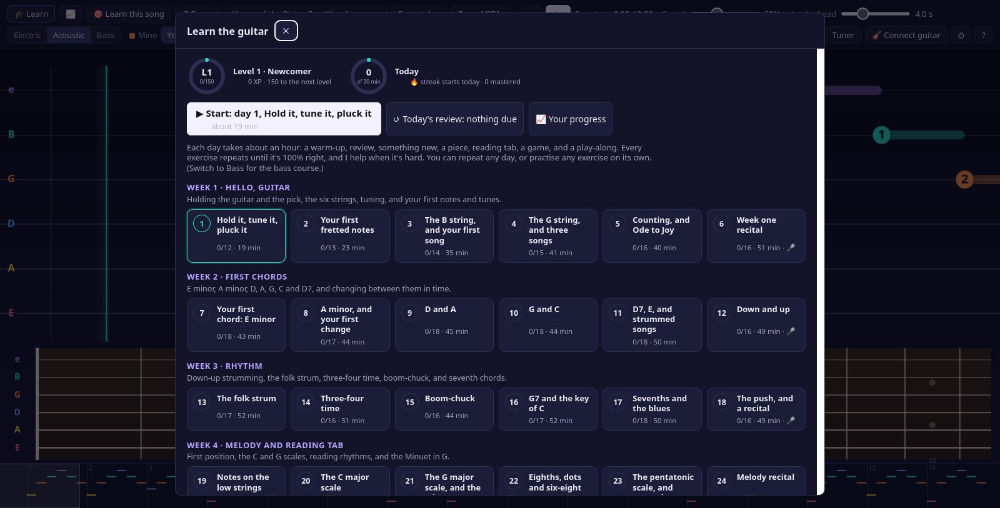
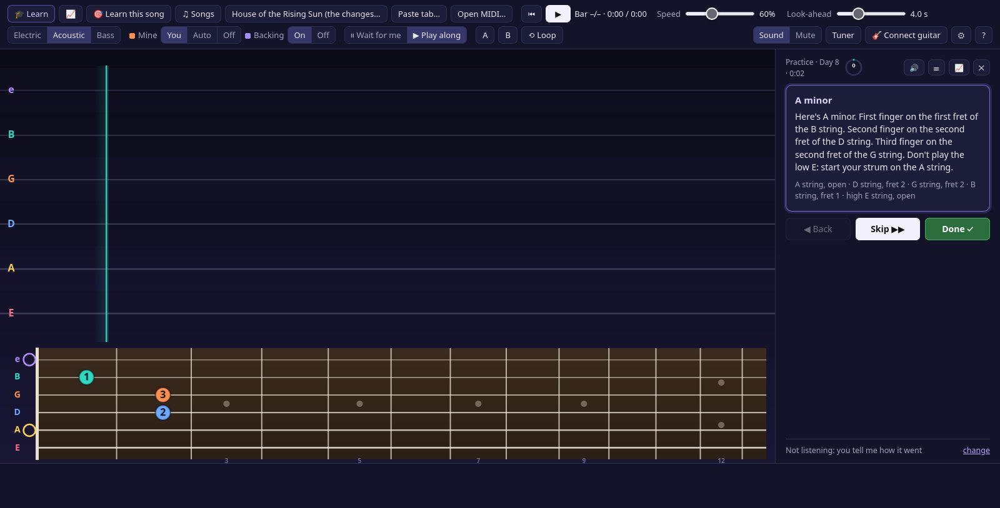
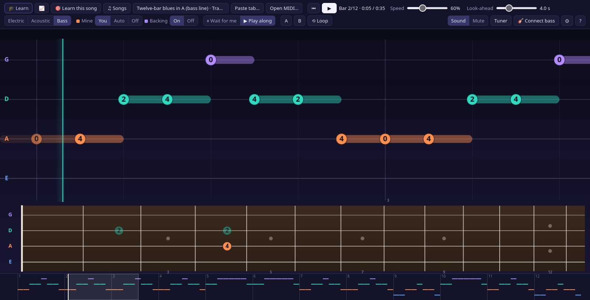

## What it is

Guitar Trainer is the guitar and bass version of [Piano Trainer](/work/piano-trainer). It runs in a web browser with no account and nothing to install: try it at **[guitar.jlwhite.ca](https://guitar.jlwhite.ca)**, or open it straight from a folder of files, offline.

A piano's falling notes don't suit a guitar, so the screen is a tab highway instead. Each string is a lane, with the high E on top the way tab is written, and the notes slide toward a playhead carrying the fret to press. Strums show as a column of frets with an arrow for down or up and the chord's name above it. Underneath, a fretboard lights up where the fingers go, with a finger number on each note. You can slow any song down without changing its pitch, loop the bars you keep missing (the loop goes straight round, in time, with no pause at the join), or have it wait at each note or chord until you play it.

One switch changes the instrument: electric, acoustic or bass, each with its own sampled sound. Guitars can be in standard tuning, drop D, DADGAD, open G or half a step down, and a bass in standard, drop D or half a step down; songs are re-placed on the neck for the tuning you're in. Everything mirrors for left-handed players. There's a tuner built in, and it's accurate to a couple of cents.

## Getting started

The first time you open it, a welcome appears straight away, before the rest of the page has even loaded. It asks which instrument you're playing and how it's connected, then checks it can hear you by having you play the open low E, with the tuner's reading beside it and a button into the tuner if you're out. Then there's a spotlight tour of the screen, and it takes you into day one of the course or into the song library.

On a phone or tablet the controls fold into a ⋯ panel, the teacher's panel moves under the music, and when the screen is the instrument the fretboard shows fewer, wider frets so a finger can hit them.

## Listening to a guitar

It hears you through an audio interface or a USB guitar cable (with your guitar played back through the laptop, so you can hear yourself), through a microphone for an acoustic or an amp, or from a MIDI guitar. On a phone or tablet, the fretboard on the screen can be the instrument.

A guitar is harder to hear than a piano in a few specific ways:

- **Strums.** A chord on a guitar doubles its notes in several octaves (an E chord is E B E G♯ B E), and most of them are overtones of the lowest string, so they can't each be proved in the spectrum. A strum counts when every one of the chord's note *names* was struck. A wrong chord still fails: a G chord has nothing at an E's fundamentals.
- **Low notes.** A bass's low E is 41 Hz, and down there the semitones are only about 2.5 Hz apart. For a bass, the detector listens with a longer window and a finer spectrum, down to 35 Hz so drop D works too.
- **Techniques.** Hammer-ons, pull-offs and slides don't have a pick attack. A new pitch that holds steady for a moment counts as a new note even without one.

It's tested the way it's used. One harness plays every exercise in both courses, all 1,069 of them, correctly through the app's own guitar and bass samples with room noise, into the detector the way a cable does, and fails if a single note is missed or marked wrong; it found and fixed a bass note re-plucked while it rings, a chord struck again while it rings, fast repeated notes, and bends. Another feeds the detector a wrong note, a wrong chord, and a ringing note that must not be counted twice, all of which must *not* count.

There are honest limits. Through a microphone the room is noisy, so only right notes are counted; judging wrong ones needs the cable or MIDI.

## Two courses

There's a course for the guitar and one for the bass, 48 days each over eight weeks, about an hour a day. Each day has the shape of a lesson: tune up, a warm-up, a review of earlier exercises that are due again, something new, a piece, reading tab you've never seen, a game, and a play-along to finish. The last day of most weeks is a recital.

The **guitar** course (932 exercises, about 38 hours) goes from holding the pick and the six open strings to first melodies, the open chords, strumming patterns (down-up, the folk strum, waltz time, boom-chuck), reading tab, the C and G scales and Petzold's Minuet, fingerpicking (p-i-m-a, arpeggios, Travis picking, House of the Rising Sun), power chords, riffs and a twelve-bar blues shuffle and solo, barre chords and the A minor pentatonic box, and finally Für Elise, Morning Mood and a graduation recital.

The **bass** course (689 exercises, about 31 hours) covers plucking with two fingers, muting, one finger per fret, following chord changes with roots, root-and-fifth and the country two-beat, scales and arpeggios, rock, soul and funk grooves, the twelve-bar boogie line, walking bass with chromatic approach notes, playing up the neck, and the real bass lines of Pachelbel's Canon and the Minuet in G under their tunes.

As in Piano Trainer, it keeps you on an exercise until you get it 100%, and the help escalates when you're struggling: which bar went wrong, then slower or waiting for you, then just the tricky bars until they're right twice running, then a suggested break and a "skip for now" that brings the exercise back in a later review.

The games are the ones guitar teachers actually use. **One-minute changes** has you switch between two chords, strumming each once, as many times as you can in a minute; the count only goes up when the whole chord rings. **Name that chord**, **find the fret** (a note anywhere, or on a given string), **echo me** (play back a riff you can hear but not see) and a rhythm game fill out the rest. Reviews are spaced at 1, 2, 4, 8 and 16 days, and there are XP, levels from *Newcomer* to *Headliner*, badges for things like your first barre chord or a walking bass line, a daily goal and a streak.

The teacher talks, in a choice of two voices: every intro, exercise, hint and word of encouragement in both courses, and the welcome tour, is pre-recorded with the Kokoro text-to-speech model running locally, more than two thousand lines in each voice. Each clip was transcribed back with Whisper to check it says what the script says, which caught the note A being read as "eye" and a few composers' names.

## Songs

The library has 365 songs, about twelve and a half hours of music, in three parts.

**Classical guitar.** 58 complete pieces from the [Mutopia Project](https://www.mutopiaproject.org)'s public-domain and Creative Commons editions: studies by Sor, Carcassi, Giuliani, Carulli, Aguado and Mertz for the early months, then Bach's Bourrée in E minor and Prelude BWV 999, the Spanish Romance, and Tárrega's Adelita, Capricho árabe and Recuerdos de la Alhambra. Every repeat is written out, D.C. and D.S. endings included. The edition's own string numbers and fingering are kept, and every other note gets a string, fret and finger from the same model the app uses. For the bass there are 13 movements from Bach's cello suites, played an octave below the cello the way bassists read them.

**The songbook.** 37 public-domain tunes, from Hot Cross Buns to Scarborough Fair, Amazing Grace and the Skye Boat Song, played as whole songs: an intro, then verse after verse, with a new strumming, picking or bass pattern each time round. Each tune comes as the melody, strummed while the band plays the tune, fingerpicked, as a bass line under a strumming guitar, and as a melody in the bass's range. The melodies added most recently were checked note by note against printed scores.

**Arrangements.** Piano Trainer's pieces from score editions (Für Elise and the whole Minuet in G, The Entertainer, Chopin's preludes, Satie's Gymnopédie, Schumann, Grieg, Mozart, the Blue Danube) and its sixteen original tunes, set for guitar and bass: the melody over the rest of the score, a fingerstyle version with the melody and its bass line where a hand can reach every note, and the bass line on its own.

For anything else, you bring the music. Paste a guitar or bass tab or a chord sheet from anywhere, and it becomes a song: tab is read string by string, and a chord sheet gets a strumming pattern to choose from. A MIDI file works too: it picks out the guitar or bass part, leaves the drums out, and places the notes on the neck. Your own songs stay in your browser.

## Built for an ordinary laptop

It runs online or from a local file in Firefox, Chrome or Edge, and the courses and big song files load only when they're needed. The guitar and bass sounds are short recordings of real instruments from the [tonejs-instruments](https://github.com/nbrosowsky/tonejs-instruments) library (University of Iowa, Karoryfer Samples and Freesound recordings), trimmed and bundled so the app works without a network.

## Closing

The piano version taught me that the whole thing rests on hearing the instrument honestly. On a guitar that meant new rules for strums, low strings and techniques, and a notation for writing the courses in that knows where each note sits on the neck, so every exercise shows the fingering a teacher would use.
