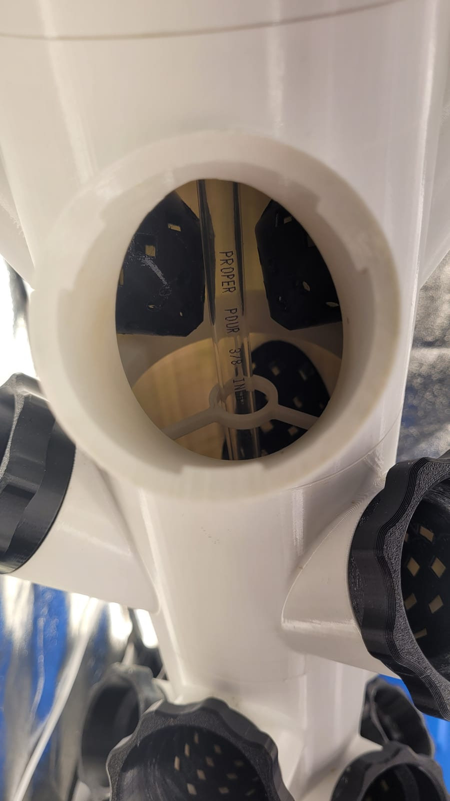
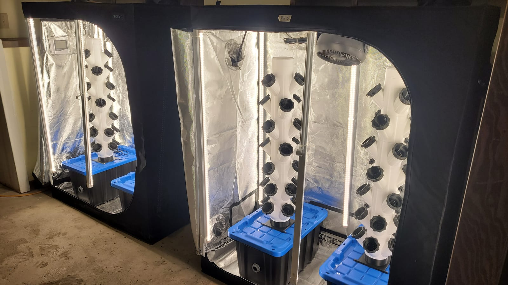

The tower is the printed backbone of the [garden](/garden) — a vertical column that grows a couple dozen plants in the footprint of a bucket. It's printed in segments that stack over a reservoir, with the [grow pods](/builds/grow-pods) clipping into it.

## How it works

A pump in the base lifts water to the top of the column, and gravity does the rest: it trickles back down through the core, past every pod's roots, and into the reservoir. One small pump feeds the whole tower. The top carries the fill guide, printed right into the part:

## Spreading the water

The trick to even growth is getting water to every level, not just the top few pods. A printed distributor cap sits under the lid and showers the flow down the inside of the column, so the lowest pods get fed too:

## In the tent

Each tower stands in a grow tent on its reservoir, with an LED bar alongside on a timer:

## Why print it

A printed tower is cheap per planting site, modular, and repairable — crack a segment and the fix is a reprint, not a new unit. The [grow pods](/builds/grow-pods) that seat into it are their own print.
