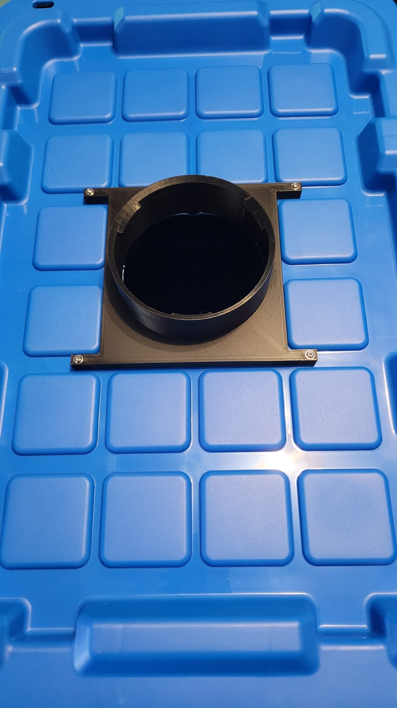

The tower was the proof of concept for the whole [garden](/garden): print a vertical, pumped hydroponic column, stand it in a grow tent, and see whether it would actually grow food indoors. It did, so everything since has been built on it. The column is printed in segments that stack over a reservoir, and the [grow pods](/builds/grow-pods) thread into it.

## How it works

A pump in the base lifts water to the top of the column, and gravity does the rest: it trickles back down through the core, past every pod's roots, and into the reservoir. One small pump feeds the whole tower. The top carries the fill guide, printed right into the part:

## Spreading the water

The trick to even growth is getting water to every level, not just the top few pods. A printed distributor cap sits under the lid and showers the flow down the inside of the column, so the lowest pods get fed too:

## Mounting it to the reservoir

The column drops through a printed flange bolted to the reservoir lid. It locates the tower, carries its weight, and keeps the return water dripping back into the tub instead of onto the floor:

## In the tent

Each tower stands in a grow tent on its reservoir, with an LED bar alongside on a timer:

## From column to garden

Proving the column worked was the first step. Turning it into a garden also needed somewhere for each plant to live, angled out toward the light and fed by the trickle inside. That's the next make, the [grow pods](/builds/grow-pods).
