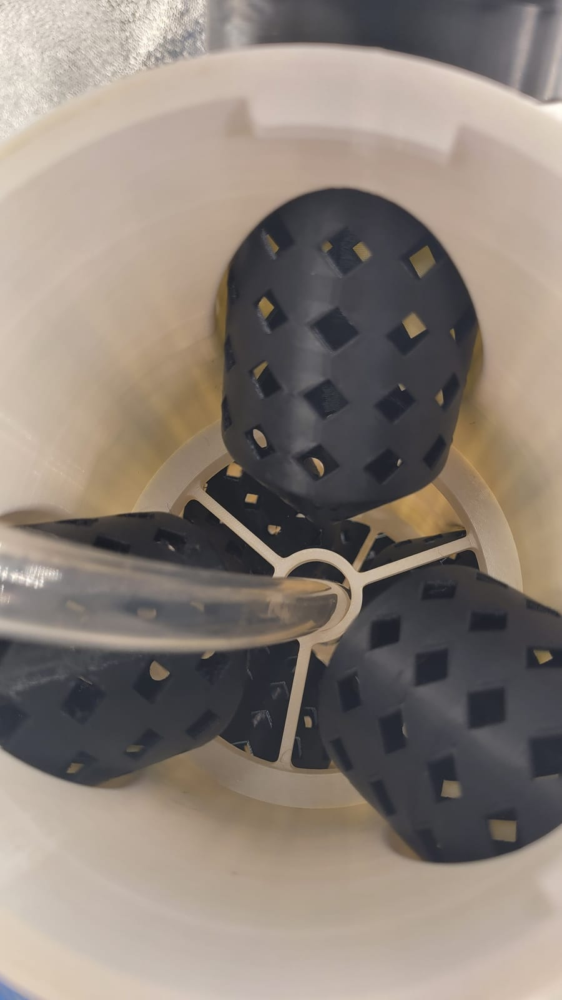

The [garden](/garden) runs on parts that came off the printer. Each vertical tower is a stack of printed segments, and every planting site is a printed net pot. Printing them instead of buying them means I can run as many towers as I have filament for, and replace a cracked part in an afternoon.

## The towers

A tower is a column of printed segments stacked over a reservoir and pump, with an LED bar alongside. Water is pumped to the top and trickles back down through the stack, past every plant's roots and into the reservoir — one small pump feeds a whole column. The fill guide is printed right into the top:

## The net pots

Each plant sits in a printed mesh basket — open enough for roots to reach the water, stiff enough to hold a maturing plant. They print fast, so I keep a stack of spares:

## Why print it

Off-the-shelf tower gardens are expensive and fixed. Printed ones are cheap per planting site, modular, and repairable — and when something doesn't work, the fix is a tweak and a reprint instead of a new order. The whole indoor [garden](/garden) is built on that.
