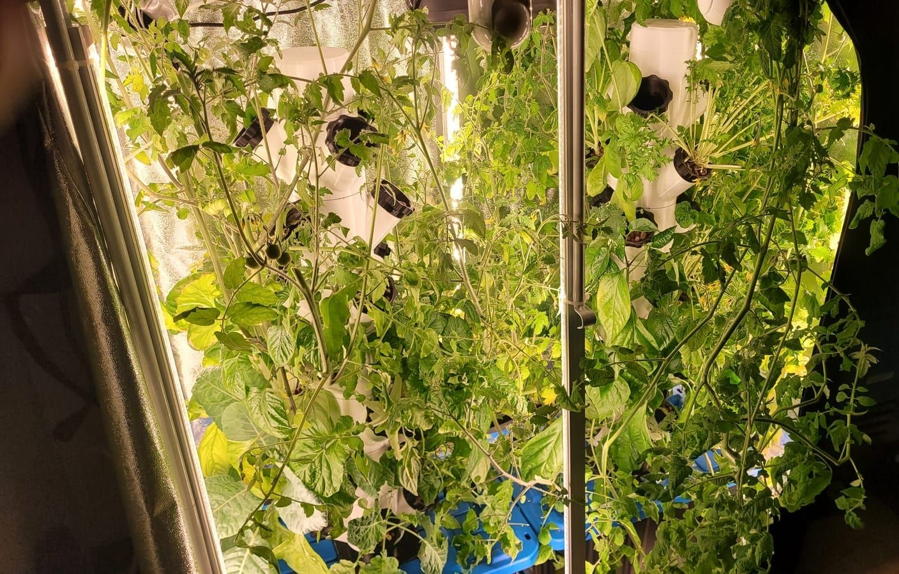
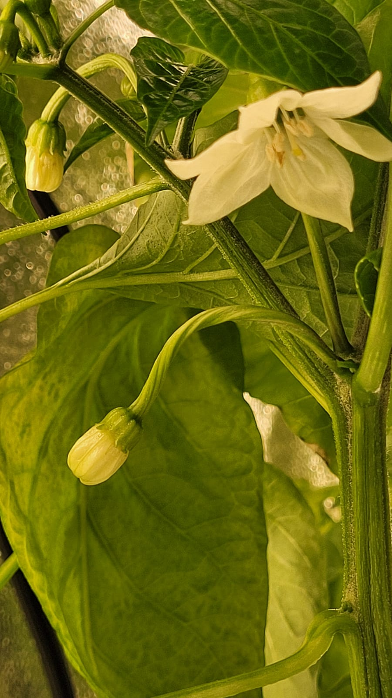
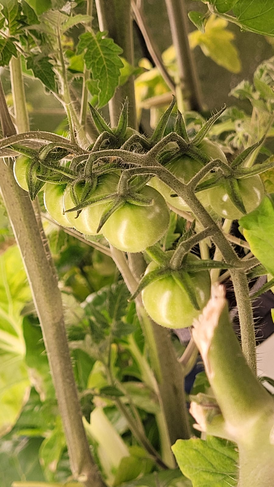

Growing food without soil, indoors, all year. It runs on **vertical tower gardens** (the [tower](/builds/hydro-tower) and its [grow pods](/builds/grow-pods) are 3D-printed) in a grow tent under LED bars. A pump lifts water to the top of each tower and it trickles back down past the roots (that's two towers in the tent, up top).

The towers pack a lot of plants into a small footprint. Lettuce, greens, herbs, and peppers, fed from a reservoir in the base and lit on a timer:

And the harvest:

Once the towers fill in, the footprint disappears under leaves. Greens and herbs early on, peppers and more as things mature:

The towers grow more than salad. Peppers flower and set fruit indoors, out of season:

And the tomatoes go the whole way. Full trusses ripen on the vine, in a tent, in the off-season:

By late summer the canopy spills out of the pods until you can barely see the towers underneath:

Water chemistry is most of the work. pH and nutrient strength drift constantly, which is why I built [PicoPH](/builds/picoph) to keep an eye on it.
