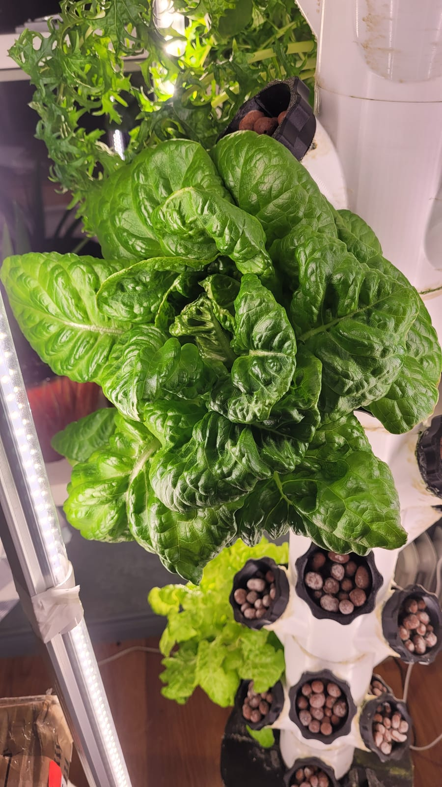
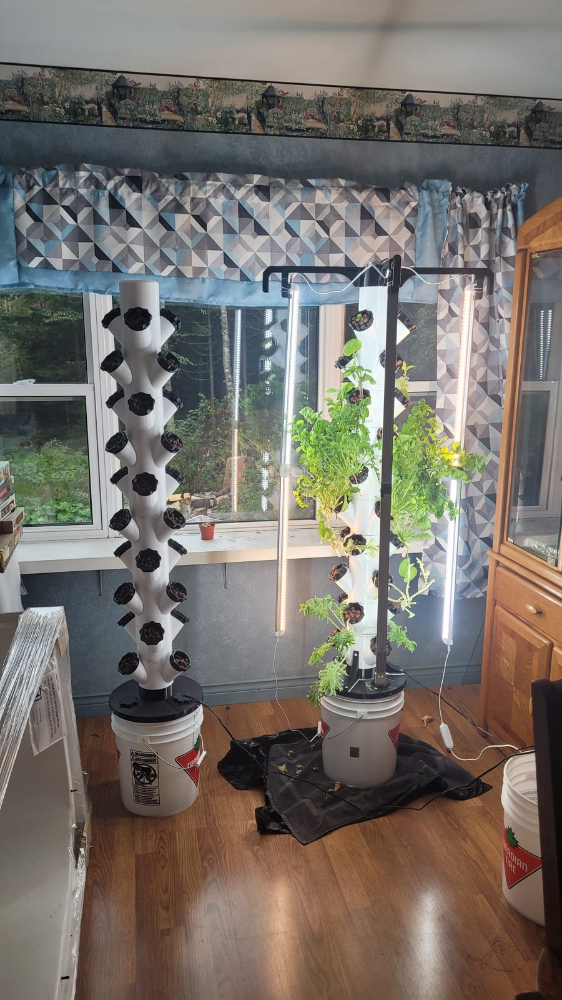
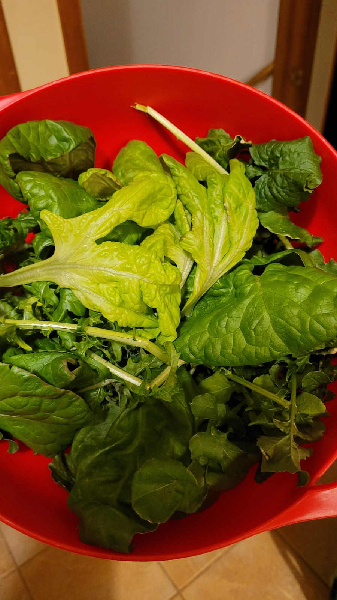

Growing food without soil, indoors, all year. What started as a couple of Kratky jars has turned into a small operation: deep-water tubs, **vertical tower gardens**, and a grow tent under LED bars (that's two towers in the tent, up top).

The towers pack a lot of plants into a small footprint — lettuce, greens, herbs, and peppers — fed from a reservoir in the base and lit on a timer:

And the part that makes it worth it:

Water chemistry is the whole game — pH and nutrient strength drift constantly — which is exactly why I built [PicoPH](/builds/picoph) to keep an eye on it.
