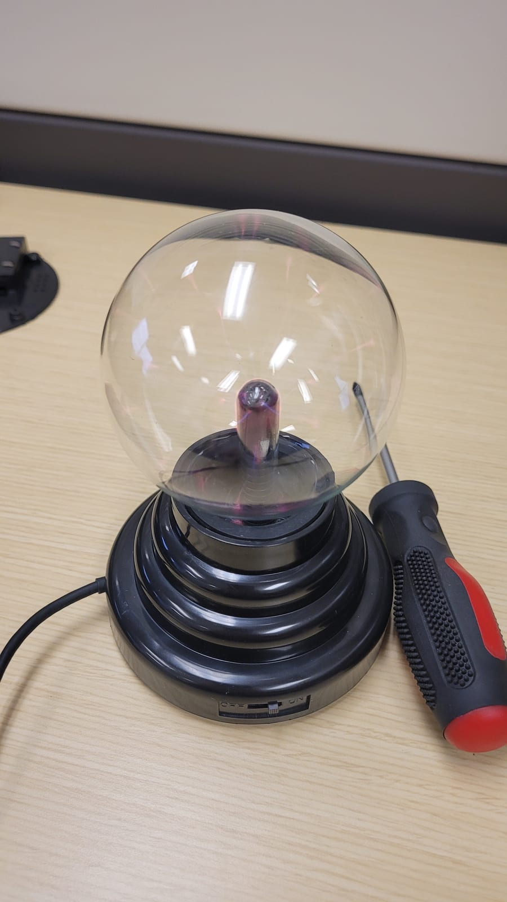
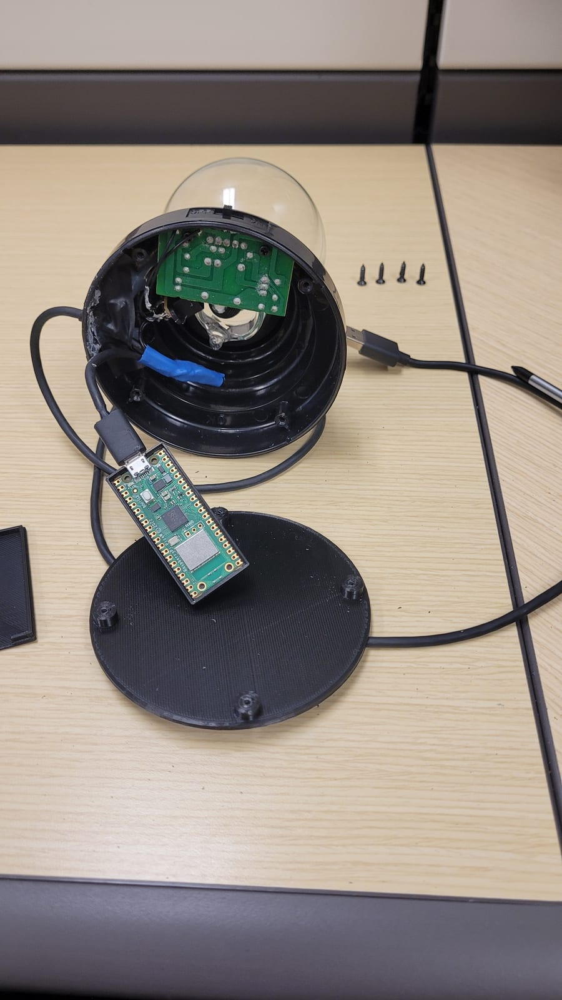
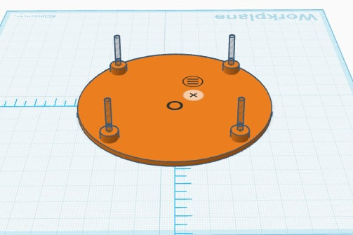
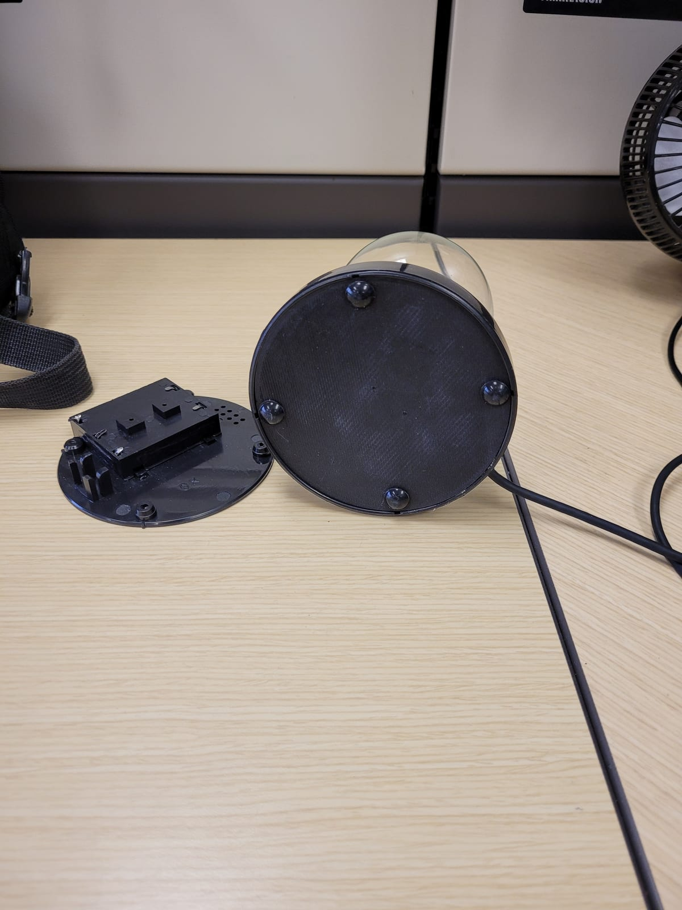

It really is a plasma globe: the lamp and driver are left intact, rewired to run from USB instead of the original batteries. Tucked into the base is a **Raspberry Pi Pico W** that the computer sees as a USB mouse. Plug it in and every so often it nudges the cursor a few pixels, so the machine never idles or locks. Harmless on its own. The point is the lesson underneath it: a USB device can be anything, and the case it comes in tells you nothing.



## The build

The globe was battery-powered, so most of the work was mechanical:

- Open the base and fit a Pico W on a printed bracket, powered off the same USB lead that runs the globe.
- Print a replacement bottom plate to match the original, with feet and a slot for the cable, so the underside looks stock.
- Close it up. From the outside it is a plasma globe with a USB cable, which is the point.



Nobody looks twice at a desk toy. The disguise is the whole trick.





## How it works

The Pico runs **CircuitPython**, which lets it present itself to the host as a standard USB HID mouse. The program is a few lines: move the pointer a little, move it back, wait, repeat.

```python
# code.py: runs automatically whenever the Pico has power
import time
import random
import usb_hid
from adafruit_hid.mouse import Mouse

mouse = Mouse(usb_hid.devices)

while True:
    # a small nudge and back: the pointer barely moves,
    # but the host never sees the session go idle
    dx = random.randint(5, 15) * random.choice((-1, 1))
    dy = random.randint(5, 15) * random.choice((-1, 1))
    mouse.move(x=dx, y=dy)
    time.sleep(0.3)
    mouse.move(x=-dx, y=-dy)
    time.sleep(random.randint(30, 90))
```

Programming it is file copying, no toolchain:

1. Hold **BOOTSEL** and plug the Pico in. It mounts as a drive called `RPI-RP2`.
2. Copy the CircuitPython `.uf2` onto it. It reboots as a drive called `CIRCUITPY`.
3. Drop the `adafruit_hid` library into the `lib/` folder.
4. Save the code above as `code.py`. CircuitPython runs `code.py` on every power-up, so the globe starts jiggling the moment it is plugged in.

## Why bother

This is the friendly version of an old trick. The malicious one swaps the mouse for a **keyboard** that types its own commands the instant it is plugged in (a "BadUSB" or Rubber Ducky attack), and the few seconds before anyone notices is plenty.

I built it after watching Google's **[Hacking Google](https://www.youtube.com/watch?v=TusQWn2TQxQ)** series, specifically the Red Team episode. To get into the Google Glass project, their red team sent employees **USB plasma globes loaded with malware**, dressed up as a work-anniversary gift: "Congratulations on your anniversary for working at Google. Here is a small gift." Someone plugged one in, and that was the foothold into the Google Glass project. The plasma globe here is a nod to that story.

So the takeaway is the boring, durable one: do not plug unknown USB devices into your computer, including the free ones, the found ones, and the gift ones. The friendly desk toy and the attacker's tool are the same shape.
