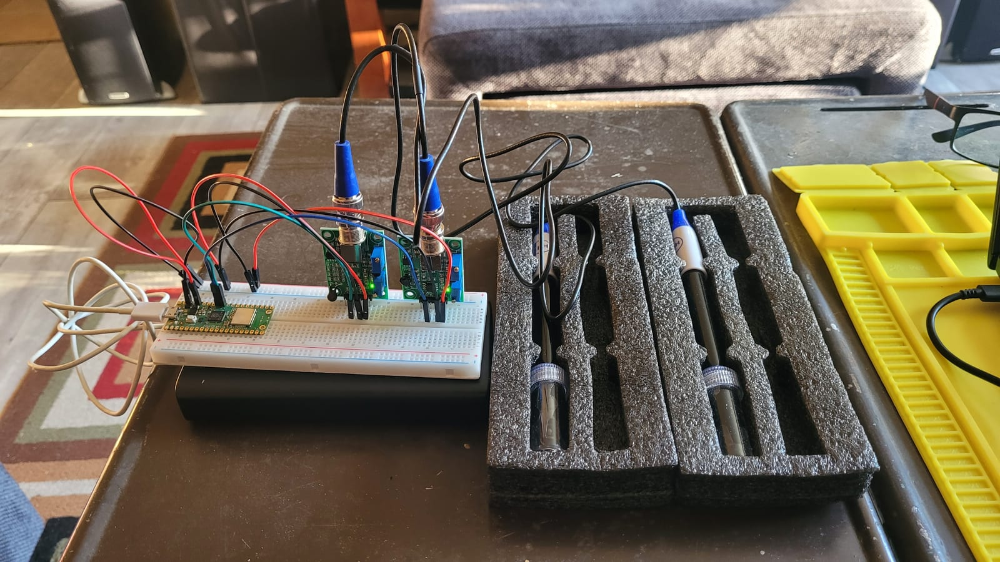
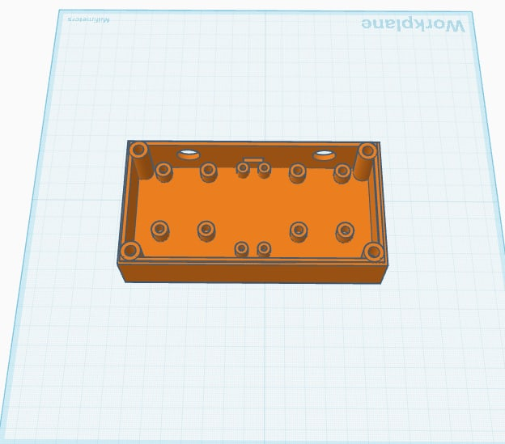
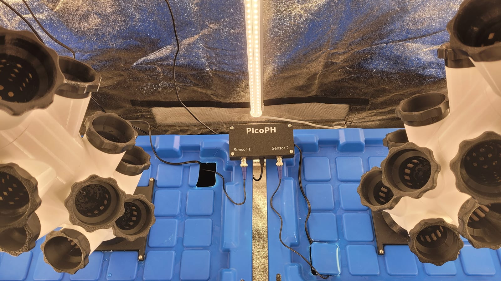

Hydroponics lives and dies on water chemistry: pH and EC (how strong the nutrient solution is). Buying a commercial monitor is easy; building one teaches you what the numbers mean. So I built **PicoPH**.

A Raspberry Pi Pico reads two analog probes, pH and EC, each through its own signal-conditioning board (the blue trimmers set offset and gain during calibration), with the BNC-terminated probes dropping into the reservoir.

The enclosure started as a hand sketch (board spacing, standoffs, cable-gland cut-outs), got modelled in Tinkercad, and became a printed box sized to the exact hardware (that's the sketch-and-box up top).

Then it went to work, watching the towers:

It's the project that ties the three hobbies together: a bit of electronics, a bit of 3D printing, in service of the [garden](/garden/hydroponic-garden).
