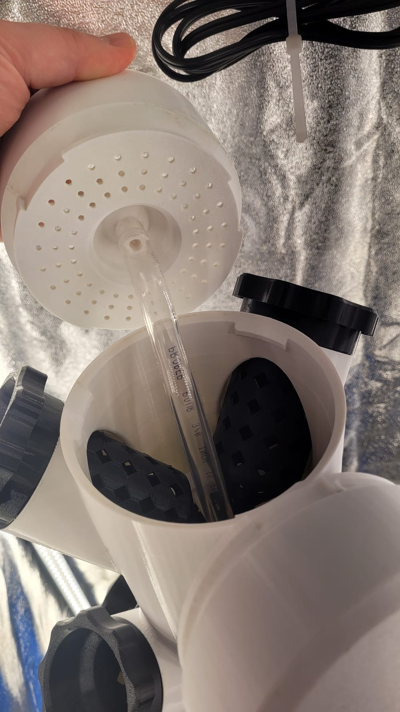

A shelf of FDM printers: two Bambu Lab P1Ps with AMS for anything that needs colour or needs to come out right the first time, and three Creality machines — two Ender 3s and a CR-10 V3 — for the big jobs and the disposable ones. Everything's modelled in [Tinkercad](https://www.tinkercad.com), which is about as far from production CAD as you can get and exactly enough for net-pots, brackets, and the occasional fish. Most of what comes off the beds is functional — the parts that make the [garden](/garden) and the [lab](/lab) work — and every so often something prints purely because it's satisfying to make.

## What earns its keep

The hydroponic side of the house is almost entirely printed. The [tower](/builds/hydro-tower) is a stack of printed sections capped by a perforated distributor that rains the water back down the inside; the [grow pods](/builds/grow-pods) that turn it into a garden are printed mesh baskets and threaded collars, one per plant:

The same beds turned out the [PicoPH](/builds/picoph) sensor enclosure and the net-pots, fittings, and jigs that don't photograph well but quietly hold everything together. None of it is precious — when a part wears out or a design gets better, I print the replacement and move on. That's the appeal of owning the means of production: the spare-parts bin is a slicer and a spool of filament.

## And the occasional sea creature

The articulated octopuses on the shelf up top are the other side of it: print-in-place, no supports, no assembly. They come off the bed already wiggling, which makes them a brutal test of tolerances — too tight and the joints fuse, too loose and they flop.

### A salmon that says "Never Give Up"

A wall-mounted salmon head on a printed plaque — the scale texture, the green eye, and the red gum line are all in the filament, not paint. It's the kind of multi-colour print the AMS earns its keep on.
