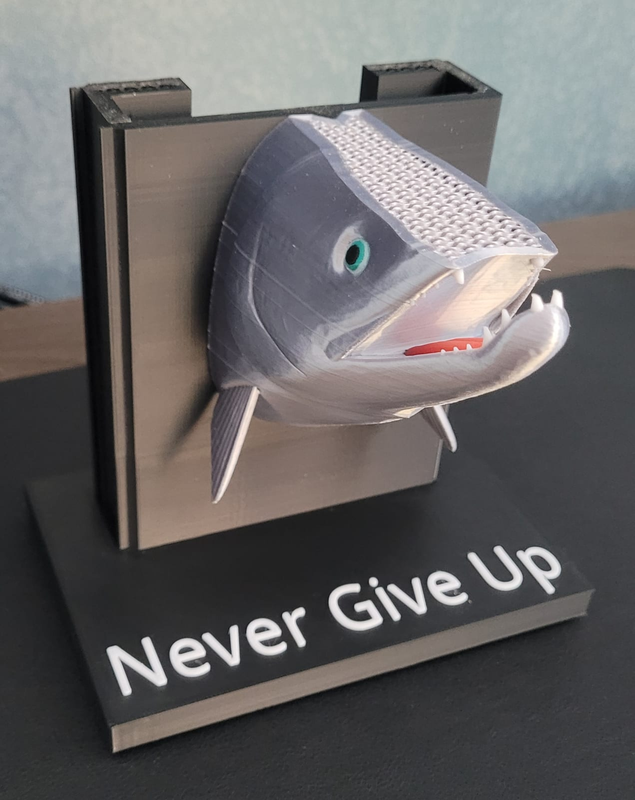
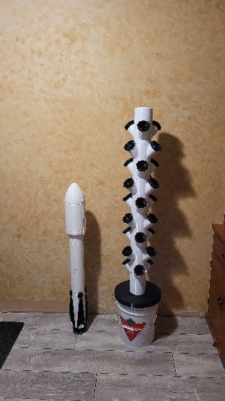

A shelf of FDM and resin printers that mostly earns its keep on practical parts — net-pots and fittings for the [hydroponic garden](/garden/kratky-lettuce), enclosures, jigs — but also makes things purely because they're satisfying to make.

The articulated octopuses up top are a good example: print-in-place, no supports, no assembly. They come off the bed already wiggling, which makes them a brutal test of tolerances — too tight and the joints fuse, too loose and they flop.

## A salmon that says "Never Give Up"

A wall-mount fish with painted-on scale and eye detail (a layer-swap colour technique), mounted on a printed plaque.

## A Falcon, scaled down

Because every print shelf needs a rocket.

*The [PicoPH sensor enclosure](/builds/picoph) was printed here too — that one earns its keep.*
