## What it is

Taking over a network is mostly archaeology. An acquisition, a handover from a departing engineer, or a new job: the network comes with a spreadsheet that was last right two years ago and a diagram of how somebody meant it to be. SubnetSleuth is for that moment. You give it the address ranges you are responsible for and a read-only SNMP credential, and it reads the network's own devices to work out what is actually there and how it connects.

It is a **Windows desktop app** and a **command-line tool** (Windows and Linux) that share one project file. It is free and open source: the installer, a portable zip and the command-line builds are on the [releases page](https://github.com/kerbe42/subnetsleuth/releases/latest), and the code is at [github.com/kerbe42/subnetsleuth](https://github.com/kerbe42/subnetsleuth).

<video controls preload="metadata" playsinline poster="/media/subnetsleuth-demo-poster.jpg" aria-label="An 80-second tour of SubnetSleuth: a live scan, then the map, device, host, subnet, path and deep-scan views">
  <source src="/media/subnetsleuth-demo/index.m3u8" type="application/vnd.apple.mpegurl" />
  <source src="/media/subnetsleuth-demo.mp4" type="video/mp4" />
</video>

The tour above was recorded from the app itself, driven by a script. The scan in it is of the simulated campus that ships with the app (*Help ▸ Explore the sample network*), so it can be shown without pointing at anyone's real network.

## Scanning

A scan starts from the ranges you look after, pasted the way they arrive: CIDR blocks, single addresses or `10.20.0.10-60` style ranges. Any size works. A /16 is swept in full, and the dialog says roughly how long that will take. You can also name a core switch or router to start from, and list ranges that must never be sent anything, such as OT, medical or partner links.

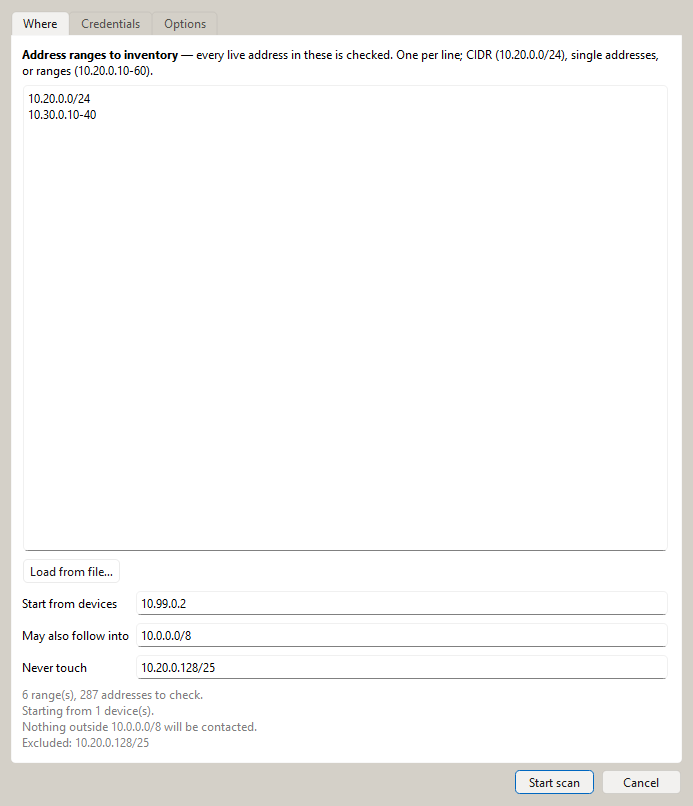

From there it works in stages:

- **Find what is alive.** Each range is ping-swept with Nmap, one /24 block at a time and eight blocks at once, with aggressive discovery timing so a block of dead, firewall-dropped addresses is given up on in seconds rather than minutes — sweeping several /16s takes minutes, not hours. A block that runs out of time keeps every host it had already found, and the rest is tried again with twice the time.
- **Read the devices.** Everything that answers is tried over SNMP. From each device it reads LLDP and CDP neighbours, routing tables, ARP and MAC address tables, VLANs, interfaces, hardware and serial numbers. What each device *is* — a switch, a router, an L3 switch, a firewall, a wireless access point — is decided from the capabilities it and its neighbours advertise, its bridge table and its ports, rather than guessed from its model name, so unfamiliar kit is still typed correctly. Neighbours, next-hop routers and subnet gateways are followed outwards to more devices.
- **Identify the hosts.** Hosts are identified with small, read-only probes: NetBIOS, mDNS, SSDP, web and TLS banners, SSH banners, and the building and industrial protocols (BACnet, Modbus, EtherNet/IP, IPMI) that show up on real estates.
- **Scan ports.** Nmap service scans go only to addresses that answered, so it never waits out every port of a switched-off PC.

While it runs, the Activity panel's **Now:** line names exactly what is in flight: the /24 blocks being swept, the batch being port-scanned and Nmap's current stage, the devices being polled. On a large network that line is the difference between "it's working" and "is it stuck?".

If the SNMP credentials came with the network, you add them. If they did not — common on a network nobody documented — SubnetSleuth can also try the handful of well-known factory-default community strings, read-only, after anything you did provide. Any device that still answers one is listed under *Needs attention* so you can change it.

Everything it sends is read-only (SNMP GET and GETBULK, never SET), and every step checks the same scope before contacting an address, so nothing outside your ranges is touched, whichever step found it.

## What it works out

The **Overview** is the first answer to "what have we got". It separates the network itself — firewalls, routers, switches and access points, with the gear you have not yet polled shown as a lighter part of each bar — from the endpoints attached to it, grouped by kind (PCs, phones, printers, servers and so on). Alongside are the gear by vendor, the busiest subnets, what each server actually does, and the findings that need attention.


**Topology.** The physical map is worked out from LLDP and CDP neighbours, so it shows the cabling, including the devices that don't speak LLDP. Where a network has LLDP and CDP switched off entirely — so the switches report no neighbours at all — SubnetSleuth reconstructs the switch‑to‑switch links from the bridge MAC tables instead: the port through which one switch learns another switch's address is the port facing it. Those inferred links are drawn dashed, to set them apart from links a device actually reported. The logical map shows subnets, gateways and the routers between them. Maps can be laid out automatically or by hand, positions are saved in the project, and they export to draw.io (and from there to Visio).

Large networks stay readable. Nothing is drawn on top of anything else, in any view: on a simulated campus of about 1,600 devices and hosts, the overlapping pairs went from around 1,300 to none, and the layout takes a fifth of a second. Redundant pairs sit side by side, each switch's hosts pack into a grid beneath it, and very wide tiers wrap. Zoomed out, each switch's hosts become a single "38 hosts" badge while the switches, firewalls and access points keep their names: the endpoints collapse first and the network last.

**Paths.** Pick any address and SubnetSleuth traces the path to it, switch by switch through the MAC tables and router by router through the routing tables, and lights it up on the map.

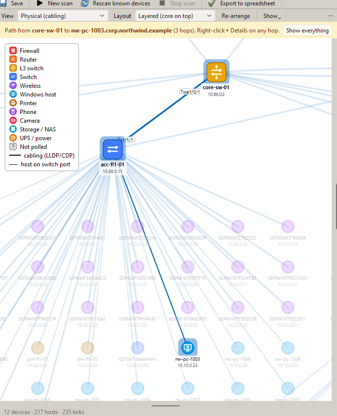

**Devices.** Each device has its model, serial number, software version and uptime, its interfaces with VLANs, speeds, errors and PoE, its neighbours, ARP and routing tables, redundancy groups, routing peers and spanning-tree role. Switches get a faceplate of their ports.

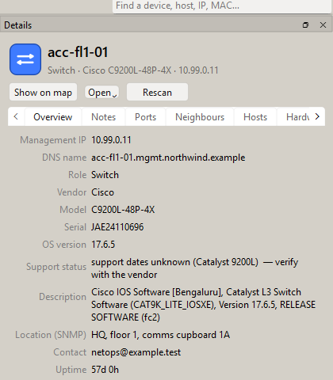

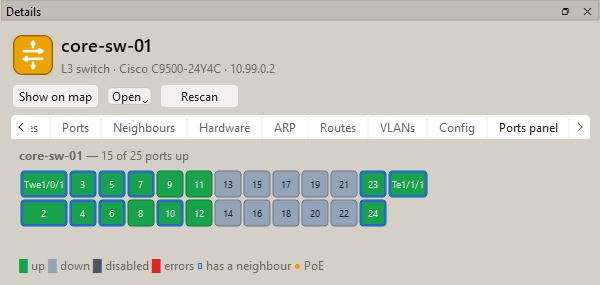

**Hosts.** Every address seen in an ARP table, a MAC table or a sweep becomes a host, with its vendor, the switch port it is plugged into, and a type (Windows PC, printer, phone, camera, hypervisor, database server…). Each type comes with a confidence level and a *Why* tab listing the evidence behind it: a MAC vendor, open ports, a NetBIOS name, an mDNS service, a web page title.

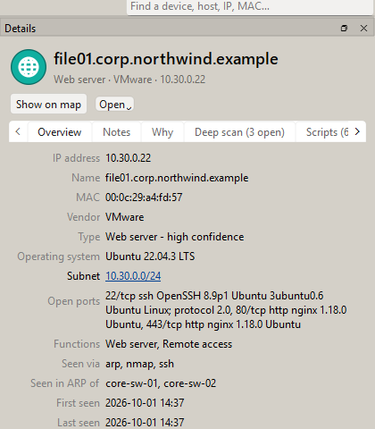

**Subnets.** Each subnet gets an address map of what is used, what is free and what is on each address, with its gateway, VLAN and utilisation, so you can tell the swept subnets from the ones that are only known from routing tables.

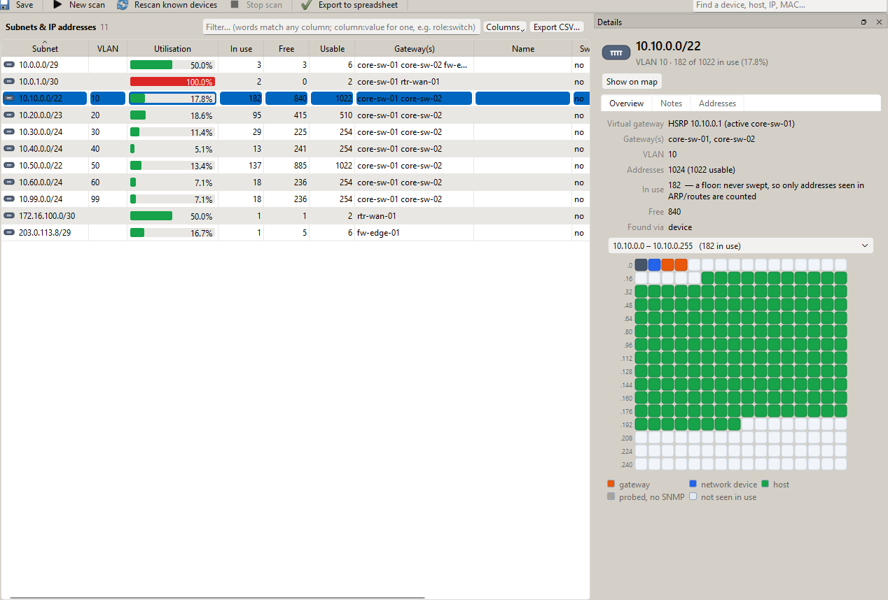

## One place for access

Taking stock of a network means signing in to a lot of things: SNMP on the switches, SSH on the routers, a domain account for Active Directory and the DHCP servers, an API key for the cloud dashboard, a read-only admin on each firewall manager, an account for vCenter. SubnetSleuth keeps all of it in one place. **Credentials** are saved once and chosen wherever a job signs in, so one domain service account can serve Active Directory, every DHCP server and the inspection of Windows hosts, and changing its password is one edit. **Connections** are the systems to read from, each with its settings and the credential it uses, and a **Test** button that signs in and reads one small thing without pulling anything. **Pull all** reads every connection into the project, and can follow each scheduled rescan.


Secrets never go into a project file. On Windows they are encrypted for the Windows account, or a secret can be read from an environment variable each time it is used. A secret that can't be read, because it was saved under another account or its variable isn't set, is reported as such rather than quietly sent empty. A credential that belongs to one customer's network can be limited to that network, so it is never tried anywhere else. Every use is written to the log: which credential, for what and against what, never the secret. The command line reads and writes the same list, so a connection set up in the app can be pulled from a scheduled job on a jump box.

## What the firewalls and the domain already know

A scan from the outside only sees what answers. The people who ran the network left a lot more behind in their own tools: the firewall knows which tunnels go where, the cloud dashboard knows which switch port and VLAN every laptop is on and who signs in to it, the firewall manager knows the serial and firmware of boxes that are switched off today, and Active Directory knows every machine that has joined the domain and what each site's subnets are called.

SubnetSleuth reads that, read-only, from **Cisco Meraki**, **Cisco Security Cloud Control**, **Cisco Secure Firewall Management Center**, **FortiGate** and **FortiManager**, **Palo Alto** firewalls and **Panorama**, **Check Point**, **SonicWall** and **Sophos**, from **Active Directory**, Windows DNS and DHCP servers and any DNS server that allows a zone transfer, and from **VMware vCenter**, which knows every virtual machine and the host it runs on. A DHCP server's lease export goes through the same path. Each connector sends only the requests on its own read-only list, checked before anything leaves the machine, and sends credentials only to the platform's own address, never to a redirect elsewhere.

What comes back is lined up with what the scan found. A device the platform manages is matched to the polled device by serial number, then MAC, address and name, and a serial that disagrees vetoes the weaker clues. Clients and DHCP leases follow their MAC, so a laptop that has taken a new address shows as **moved** instead of becoming a second laptop, and an address that now belongs to a different machine is flagged as **re-assigned**. That is the trap of scanning a DHCP network repeatedly: done by IP address alone, it counts the same machine twice and attaches it to the wrong record. A **Sources** page lists every record and where it landed: on a polled device, on a host, added to the map, or kept off it because its only address was public.


**What a pull points at gets identified and scanned.** The boxes a platform manages are listed with the network devices, its own LLDP and CDP links are drawn as cabling, and each client hangs off the switch port or access point the platform saw it on, so a network known only from its dashboard is already a connected map. What the platform says about each client — "iPhone", "Printer", "Windows 11", the maker — is weighed with everything else the scan found, so phones and tablets, laptops, printers, desk phones and cameras come out as what they are. When a pull finishes, SubnetSleuth offers to scan what it found: the internal subnets the platform serves are added to the scan ranges and swept, and the devices it manages are polled and their neighbours followed. Networks behind a site-to-site tunnel are left out, because a tunnel can lead to a partner's network.

**VPN tunnels go on the map.** Every site-to-site tunnel a platform reports is drawn from the firewall that owns it to the far end, green when it is up and red when it is down. The networks behind the far end hang off it on the logical view. When the far end is a box the project already knows, such as the other side of a Meraki AutoVPN pair or a branch firewall that a firewall manager reports, the tunnel joins the two. Otherwise the remote site gets its own node.

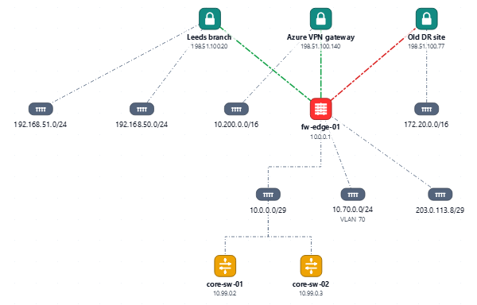

## Asking Claude about it

Once the scan and the platforms are in, the questions are about meaning: what is this network, what is missing from the handover, which records are wrong. The **Ask AI** panel answers those from the project, with ready-made questions (explain this network, what the platforms add, clean up the asset register, models and firmware, questions for the previous owner) or your own. A quick answer works from a summary of the project. A thorough one lets the model list, read and search an export of the whole project, and nothing else: it cannot run commands, change files or browse. You can preview exactly what will be sent, and addresses, MACs, serials and names can be masked before anything leaves the machine and restored in the answer.


**On a Claude plan.** Anthropic does not let other applications sign in to a Claude account, so SubnetSleuth works through Anthropic's own apps instead, under your own sign-in (single sign-on through your organisation included):

- **Claude Code**: if your plan includes it, the panel asks through your own Claude Code.
- **Claude Desktop and Cowork**: one button adds SubnetSleuth to Claude Desktop as a local connector, and each release also ships it as a desktop extension that an organisation can allow-list. In a chat or in Cowork, Claude can then read the project you last saved: a briefing, and read-only search over the exported data.
- **claude.ai by hand**: a briefing file to attach to a chat or a Claude Project, or a data folder for Cowork, with the prompt on the clipboard. Nothing is sent by SubnetSleuth.

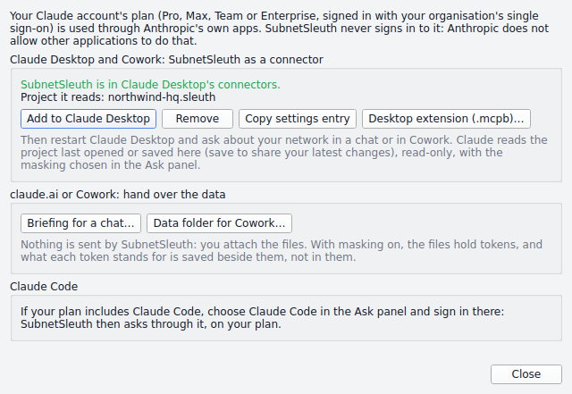

**Through an API.** Claude can also be asked through Anthropic's API, Claude Platform on AWS, Amazon Bedrock, Google Cloud Vertex AI or Microsoft Foundry. Other vendors work too: OpenAI, Azure OpenAI, Google Gemini, Mistral, xAI, OpenRouter, a local Ollama, or any OpenAI-compatible gateway. Each is saved once as an **AI provider** in the same place as the connections and credentials, offers its current models and effort levels, and can list what your account can use. An API key is an ordinary saved credential. The cloud sign-ins (an AWS profile or SSO, Google Cloud, **Sign in with Microsoft** through Entra ID) are the cloud's own, so no password is stored. Questions go only to the provider's own address over HTTPS, and nothing in the environment can redirect them or the key.

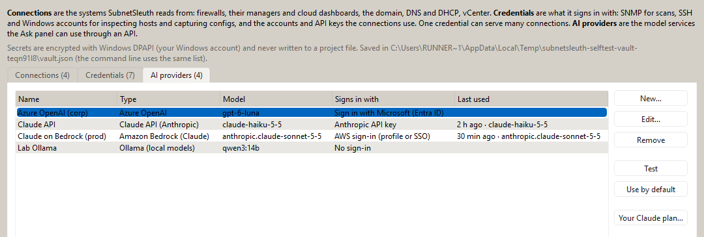

## Deep scan

Right-click any device or host, or type an address, and **Deep scan with Nmap** looks at it as thoroughly as Nmap can. It covers all 65,535 TCP ports, every service-version probe, OS detection and a traceroute, and the common UDP services if you ask. It also runs Nmap's scripts that are both *default* and *safe*, which read TLS certificates, web page titles, SSH host keys and SMB/RDP names, and nothing intrusive. The result stays in the project: every port with its product and version, the OS guesses, the uptime and the path, and a Scripts tab with what each script read.

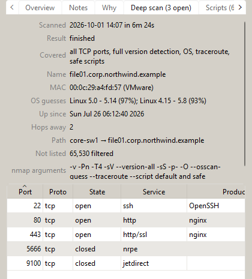

## Keeping it honest and current

**Needs attention** collects the things worth acting on: neighbours that were seen but couldn't be polled, devices that answer SNMP but hide their topology (no LLDP/CDP, MAC table or routes — usually a restricted SNMP view), links whose ends disagree on speed or duplex, VLANs named differently on different switches, subnets whose router was never reached, overlapping subnets, single uplinks. A compliance page checks device configurations against common hardening standards and flags hardware that is past, or nearing, the end of vendor support.

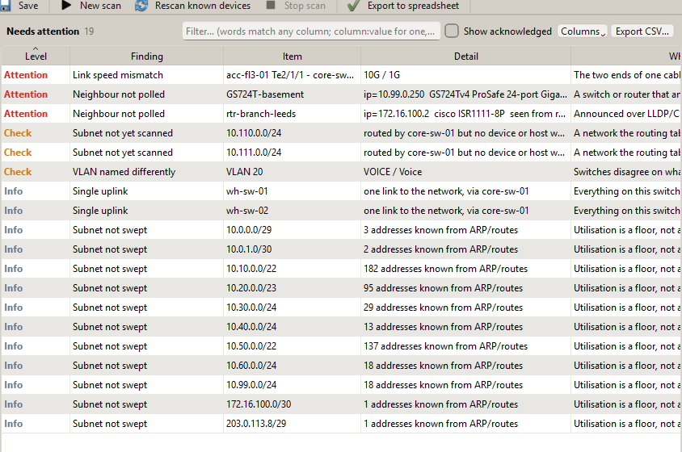

Beyond SNMP, SubnetSleuth can:

- capture running configurations over SSH and show what changed between captures;
- inspect hosts over SSH or WinRM — with your credentials it reads the OS, hardware, installed software, services and live connections (which become a dependency map of who talks to which server), and on Windows the OS product type tells a server, a domain controller and a workstation apart;
- read VMware vCenter;
- import DHCP leases;
- listen for syslog and SNMP traps while you are on site;
- reconcile everything against the asset list you were handed.

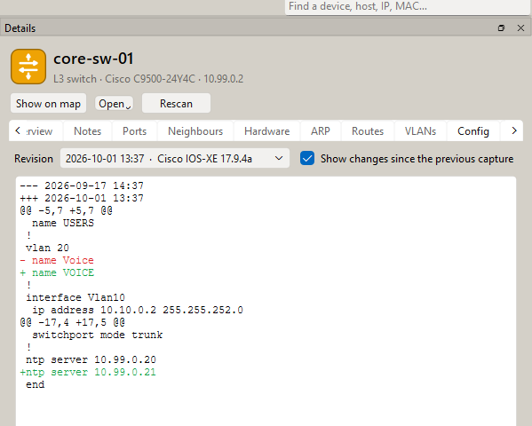

Rescans re-poll what is already known and keep your notes, the map layout and the scan history. *Compare with another scan* shows what moved, appeared or disappeared since last time.

## Sharing it

The project is one file (`.sleuth`) holding the inventory, your notes on any device, host or subnet, the map layouts and the scan history. It exports an Excel workbook with a sheet per inventory, the draw.io diagram, PDF and CSV. There is also a query language for the inventory (`hosts where os ~ windows and confidence = high`) and a read-only REST API for scripts.

The command line runs the same scanner for scheduled or repeatable runs:

```bash
subnetsleuth crawl --target-file ranges.txt -C env:SUBNETSLEUTH_COMMUNITY \
                   --identify --port-scan --out site.sleuth --xlsx site.xlsx --drawio site.drawio
subnetsleuth deepscan 10.20.0.15 -m site.sleuth
subnetsleuth diff last-month.sleuth site.sleuth
```

## Under the hood

SubnetSleuth is written in Python: asyncio for the scanning, pysnmp for SNMP (v1, v2c and v3), Nmap when it is installed, and a PySide6 (Qt) desktop app. The scan engine has no Qt in it, so the app and the command line run the same code. Saved secrets are encrypted at rest with Windows DPAPI or the system keyring, and the log masks any secret that would otherwise be written to it.

About 1,250 tests cover it, many of them against a simulated eleven-device campus and real SNMP agents bound to loopback addresses. Every connector is tested against responses recorded from its vendor's documented API, including tests that every request it can send is a read, that credentials never follow a redirect to another address, and that no secret ends up in a project file, an error message or the log. Every push builds the Windows installer on a Windows machine, starts the built app in a self-test mode that opens every page and every export, and screenshots it. Most of the pictures on this page are those screenshots.
